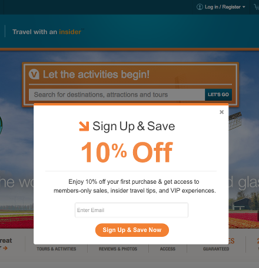
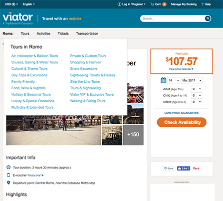
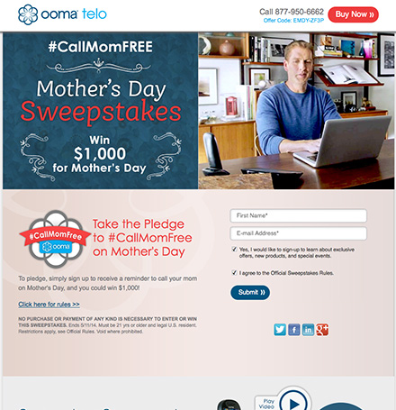
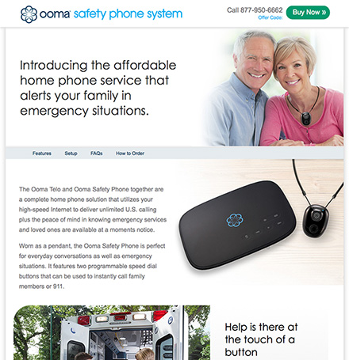

title: Projects
slug: projects

Here are a few projects that I've worked on over the years.

### Viator  

[Newsletter Signup Modal](https://gist.github.com/mchin/6751592c11f289d29e3c7a8fb3a0c784)

  **HTML, CSS, jQuery**

[Product Page Category Header Test](https://gist.github.com/mchin/605cf673e618a4d17920add4078d1084)

  **HTML, CSS, jQuery**

### Ooma

[Mother's Day Sweepstakes](https://gist.github.com/mchin/9974289375e9b29aa9e8ae1da57405dc)

**Responsive, HTML, CSS**

[Safety Phone Landing Page](https://gist.github.com/mchin/80bebc231754645a28829fc138fc4b87)

**Responsive, HTML,CSS**  

